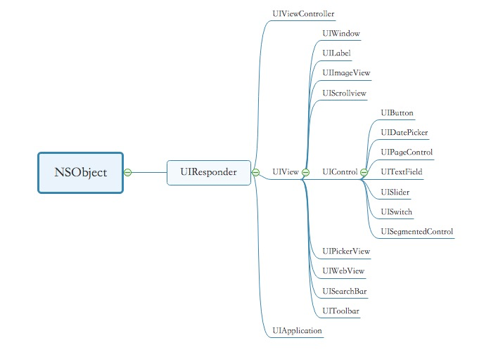

# UIResponder

## 介绍

`UIResponder` 是`iOS`中用于处理各种类型事件的基类，继承自底层类 `NSObject`，所有能响应事件的控件都继承自 `UIResponder`。


当我们在物理控件上操作某种事件时，`UIResponder`会识别到我们的操作事件并解析成能对应的事件类型，然后找到能处理事件的响应对象对事件进行处理，事件的识别传递过程既为iOS中响应链的形，成分为两大块：

### 1. 事件分发（hit-Testing）

设备识别到我们的物理事件时会形成响应的事件对象`Event`, 并通过 `HitTest`工具去查找到能执行该`Event`的载体，并激活等待执行，这个过程称为事件分发过程。
获取到`Event`后，系统`Application` 会从事件队列中按照先进先出原则取出一个事件对象，`HitTest`会首先检测该`Event` 下面的视图能否满足执行该`Event`的各种条件，如果满足就继续遍历该视图的`subviews` 直到找到最后一个满足条件的视图控件,如果最终没有找到对应控件，则会回归到自身。

`UIView` 主要通过下面两个方法来确定是否包含事件及查找事件对象。
```swift
// 寻找合适响应的view
override func hitTest(_ point: CGPoint, with event: UIEvent?) -> UIView? {
    // 是否能够接收事件
    if !self.isUserInteractionEnabled || self.isHidden || self.alpha <= 0.01 {
        return nil
    }
    // 当前点在不在当前视图范围内
    if self.point(inside: point, with: event) {
        return nil
    }
    for subview in self.subviews {
        // 坐标转换成子控件上的坐标
        let subviewPoint = self.convert(point, to: subview)
        // 检测子控件是否有更合适响应的
        if let nextView = subview.hitTest(subviewPoint, with: event) {
            return nextView
        }
    }
    // 没有找到更合适的，那就返回自己
    return self
}

// 判断点是否在调用这个方法的view上
override func point(inside point: CGPoint, with event: UIEvent?) -> Bool {
    // 可以自定义逻辑改变响应链
    return true
}
```

2. 事件传递

事件产生时会一个对应的初始对象，但是这个初始对象不一定能够处理该事件，这种情况下就会将事件继续往上层父视图传递，依次向上级查找如果直到最上层窗口->application, 还是没能将该事件处理完，则该事件会被丢弃。

`UIResponder` 中通过 `nextResponder` 方法来传递事件， 但要注意的是该方法默认返回都为`nil`, `iOS UIview` 系列控件中往上追溯父视图时都重写了`next`，将其设置为了该控件的父视图。

可以利用`next`得到控件所在的`UIViewController`等，如下：
```swift
extension UIView {

    // 得到View所在的控制器
    func nextVC() ->UIViewController? {
        var next:UIView? = self
        repeat{
            if let nextResponder = next?.next, nextResponder.isKind(of: UIViewController.self){
                return (nextResponder as! UIViewController)
            }
            next = next?.superview
        } while next != nil
        return nil
    }
}
```

## firstResponder

## touch

触摸事件

```swift
@available(iOS 2.0, *)
open class UIResponder : NSObject, UIResponderStandardEditActions {

    // Generally, all responders which do custom touch handling should override all four of these methods.
    // Your responder will receive either touchesEnded:withEvent: or touchesCancelled:withEvent: for each
    // touch it is handling (those touches it received in touchesBegan:withEvent:).
    // *** You must handle cancelled touches to ensure correct behavior in your application.  Failure to
    // do so is very likely to lead to incorrect behavior or crashes.
    // 开始触摸（手指接触）
    open func touchesBegan(_ touches: Set<UITouch>, with event: UIEvent?)
    // 触摸移动（手指移动）
    open func touchesMoved(_ touches: Set<UITouch>, with event: UIEvent?)
    // 触摸结束（手指抬起）
    open func touchesEnded(_ touches: Set<UITouch>, with event: UIEvent?)
    // 触摸中断
    open func touchesCancelled(_ touches: Set<UITouch>, with event: UIEvent?)
    // Apple Pencil 相关
    @available(iOS 9.1, *)
    open func touchesEstimatedPropertiesUpdated(_ touches: Set<UITouch>)
}
```

`touchesEstimatedPropertiesUpdated`普通的 iphone 应用开发中不会用到这个方法，这个方法是为了 Apple Pencil 的特性设计的，主要见于 Apple Pencil 和 iPad 的联动应用中，例如用 Apple Pencil 在 iPad 上画画。

主要的原因是 Apple Pencil 产生的 touch 事件的部分信息（如 Pencil 的方向等）传递到 iPad 或 iPhone 上会有一定的延时。

UIKit 的回调方法 touchBegan 是立即产生的，其返回的参数 touch 中包含了 Pencil 产生的额外信息，这个额外信息是有延时的。所以，首次回调时会给出额外信息的预估值，延时获取真实值之后会调用 touchesEstimatedPropertiesUpdated 方法更新额外信息。

## presses

响应深按事件的方法

## motion

响应运动事件的方法

```swift
import Foundation
import UIKit
import _SwiftUIKitOverlayShims

//
//  UIResponder.h
//  UIKit
//
//  Copyright (c) 2005-2018 Apple Inc. All rights reserved.
//

public typealias UITextAttributesConversionHandler = ([NSAttributedString.Key : Any]) -> [NSAttributedString.Key : Any]

@available(iOS 13.0, *)
public enum UIEditingInteractionConfiguration : Int {

    
    case none = 0

    case `default` = 1 // Default
}

public protocol UIResponderStandardEditActions : NSObjectProtocol {

    
    @available(iOS 3.0, *)
    optional func cut(_ sender: Any?)

    @available(iOS 3.0, *)
    optional func copy(_ sender: Any?)

    @available(iOS 3.0, *)
    optional func paste(_ sender: Any?)

    @available(iOS 3.0, *)
    optional func select(_ sender: Any?)

    @available(iOS 3.0, *)
    optional func selectAll(_ sender: Any?)

    @available(iOS 3.2, *)
    optional func delete(_ sender: Any?)

    @available(iOS 5.0, *)
    optional func makeTextWritingDirectionLeftToRight(_ sender: Any?)

    @available(iOS 5.0, *)
    optional func makeTextWritingDirectionRightToLeft(_ sender: Any?)

    @available(iOS 6.0, *)
    optional func toggleBoldface(_ sender: Any?)

    @available(iOS 6.0, *)
    optional func toggleItalics(_ sender: Any?)

    @available(iOS 6.0, *)
    optional func toggleUnderline(_ sender: Any?)

    
    @available(iOS 7.0, *)
    optional func increaseSize(_ sender: Any?)

    @available(iOS 7.0, *)
    optional func decreaseSize(_ sender: Any?)

    
    @available(iOS 13.0, *)
    optional func updateTextAttributes(conversionHandler: ([NSAttributedString.Key : Any]) -> [NSAttributedString.Key : Any])
}

@available(iOS 2.0, *)
open class UIResponder : NSObject, UIResponderStandardEditActions {

    // 下一级响应者
    open var next: UIResponder? { get }

    // 能否成为第一响应者
    open var canBecomeFirstResponder: Bool { get } // default is NO

    // 成为第一响应者
    open func becomeFirstResponder() -> Bool

    // 能否取消第一响应者
    open var canResignFirstResponder: Bool { get } // default is YES

    // 取消第一响应者
    open func resignFirstResponder() -> Bool

    // 是否为第一响应者
    open var isFirstResponder: Bool { get }

    
    // Generally, all responders which do custom touch handling should override all four of these methods.
    // Your responder will receive either touchesEnded:withEvent: or touchesCancelled:withEvent: for each
    // touch it is handling (those touches it received in touchesBegan:withEvent:).
    // *** You must handle cancelled touches to ensure correct behavior in your application.  Failure to
    // do so is very likely to lead to incorrect behavior or crashes.
    // 开始触摸（手指接触）
    open func touchesBegan(_ touches: Set<UITouch>, with event: UIEvent?)
    // 触摸移动（手指移动）
    open func touchesMoved(_ touches: Set<UITouch>, with event: UIEvent?)
    // 触摸结束（手指抬起）
    open func touchesEnded(_ touches: Set<UITouch>, with event: UIEvent?)
    // 触摸中断
    open func touchesCancelled(_ touches: Set<UITouch>, with event: UIEvent?)
    // Apple Pencil 相关
    @available(iOS 9.1, *)
    open func touchesEstimatedPropertiesUpdated(_ touches: Set<UITouch>)

    
    // Generally, all responders which do custom press handling should override all four of these methods.
    // Your responder will receive either pressesEnded:withEvent or pressesCancelled:withEvent: for each
    // press it is handling (those presses it received in pressesBegan:withEvent:).
    // pressesChanged:withEvent: will be invoked for presses that provide an analog value
    // (like thumbsticks or analog push buttons)
    // *** You must handle cancelled presses to ensure correct behavior in your application.  Failure to
    // do so is very likely to lead to incorrect behavior or crashes.
    @available(iOS 9.0, *)
    open func pressesBegan(_ presses: Set<UIPress>, with event: UIPressesEvent?)

    @available(iOS 9.0, *)
    open func pressesChanged(_ presses: Set<UIPress>, with event: UIPressesEvent?)

    @available(iOS 9.0, *)
    open func pressesEnded(_ presses: Set<UIPress>, with event: UIPressesEvent?)

    @available(iOS 9.0, *)
    open func pressesCancelled(_ presses: Set<UIPress>, with event: UIPressesEvent?)

    
    @available(iOS 3.0, *)
    open func motionBegan(_ motion: UIEvent.EventSubtype, with event: UIEvent?)

    @available(iOS 3.0, *)
    open func motionEnded(_ motion: UIEvent.EventSubtype, with event: UIEvent?)

    @available(iOS 3.0, *)
    open func motionCancelled(_ motion: UIEvent.EventSubtype, with event: UIEvent?)

    
    @available(iOS 4.0, *)
    open func remoteControlReceived(with event: UIEvent?)

    
    @available(iOS 3.0, *)
    open func canPerformAction(_ action: Selector, withSender sender: Any?) -> Bool

    // Allows an action to be forwarded to another target. By default checks -canPerformAction:withSender: to either return self, or go up the responder chain.
    @available(iOS 7.0, *)
    open func target(forAction action: Selector, withSender sender: Any?) -> Any?

    
    // Overrides for menu building and validation
    @available(iOS 13.0, *)
    open func buildMenu(with builder: UIMenuBuilder)

    @available(iOS 13.0, *)
    open func validate(_ command: UICommand)

    
    @available(iOS 3.0, *)
    open var undoManager: UndoManager? { get }

    
    // Productivity editing interaction support for undo/redo/cut/copy/paste gestures
    @available(iOS 13.0, *)
    open var editingInteractionConfiguration: UIEditingInteractionConfiguration { get }
}

extension UIResponder {

    @available(iOS 7.0, *)
    open var keyCommands: [UIKeyCommand]? { get } // returns an array of UIKeyCommand objects<
}

extension UIResponder {

    
    // Called and presented when object becomes first responder.  Goes up the responder chain.
    @available(iOS 3.2, *)
    open var inputView: UIView? { get }

    @available(iOS 3.2, *)
    open var inputAccessoryView: UIView? { get }

    
    /// This method is for clients that wish to put buttons on the Shortcuts Bar, shown on top of the keyboard.
    /// You may modify the returned inputAssistantItem to add to or replace the existing items on the bar.
    /// Modifications made to the returned UITextInputAssistantItem are reflected automatically.
    /// This method should not be overridden. Goes up the responder chain.
    @available(iOS 9.0, *)
    open var inputAssistantItem: UITextInputAssistantItem { get }

    
    // For viewController equivalents of -inputView and -inputAccessoryView
    // Called and presented when object becomes first responder.  Goes up the responder chain.
    @available(iOS 8.0, *)
    open var inputViewController: UIInputViewController? { get }

    @available(iOS 8.0, *)
    open var inputAccessoryViewController: UIInputViewController? { get }

    
    /* When queried, returns the current UITextInputMode, from which the keyboard language can be determined.
     * When overridden it should return a previously-queried UITextInputMode object, which will attempt to be
     * set inside that app, but not persistently affect the user's system-wide keyboard settings. */
    @available(iOS 7.0, *)
    open var textInputMode: UITextInputMode? { get }

    /* When the first responder changes and an identifier is queried, the system will establish a context to
     * track the textInputMode automatically. The system will save and restore the state of that context to
     * the user defaults via the app identifier. Use of -textInputMode above will supersede use of -textInputContextIdentifier. */
    @available(iOS 7.0, *)
    open var textInputContextIdentifier: String? { get }

    // This call is to remove stored app identifier state that is no longer needed.
    @available(iOS 7.0, *)
    open class func clearTextInputContextIdentifier(_ identifier: String)

    
    // If called while object is first responder, reloads inputView, inputAccessoryView, and textInputMode.  Otherwise ignored.
    @available(iOS 3.2, *)
    open func reloadInputViews()
}
extension UIKeyCommand {

    
    @available(iOS 7.0, *)
    public class let inputUpArrow: String

    @available(iOS 7.0, *)
    public class let inputDownArrow: String

    @available(iOS 7.0, *)
    public class let inputLeftArrow: String

    @available(iOS 7.0, *)
    public class let inputRightArrow: String

    @available(iOS 7.0, *)
    public class let inputEscape: String

    @available(iOS 8.0, *)
    public class let inputPageUp: String

    @available(iOS 8.0, *)
    public class let inputPageDown: String

    @available(iOS 13.4, *)
    public class let inputHome: String

    @available(iOS 13.4, *)
    public class let inputEnd: String

    
    @available(iOS 13.4, *)
    public class let f1: String

    @available(iOS 13.4, *)
    public class let f2: String

    @available(iOS 13.4, *)
    public class let f3: String

    @available(iOS 13.4, *)
    public class let f4: String

    @available(iOS 13.4, *)
    public class let f5: String

    @available(iOS 13.4, *)
    public class let f6: String

    @available(iOS 13.4, *)
    public class let f7: String

    @available(iOS 13.4, *)
    public class let f8: String

    @available(iOS 13.4, *)
    public class let f9: String

    @available(iOS 13.4, *)
    public class let f10: String

    @available(iOS 13.4, *)
    public class let f11: String

    @available(iOS 13.4, *)
    public class let f12: String
}

extension UIResponder : UIUserActivityRestoring {

    @available(iOS 8.0, *)
    open var userActivity: NSUserActivity?

    @available(iOS 8.0, *)
    open func updateUserActivityState(_ activity: NSUserActivity)

    @available(iOS 8.0, *)
    open func restoreUserActivityState(_ activity: NSUserActivity)
}

extension UIResponder : UIPasteConfigurationSupporting {
}
```