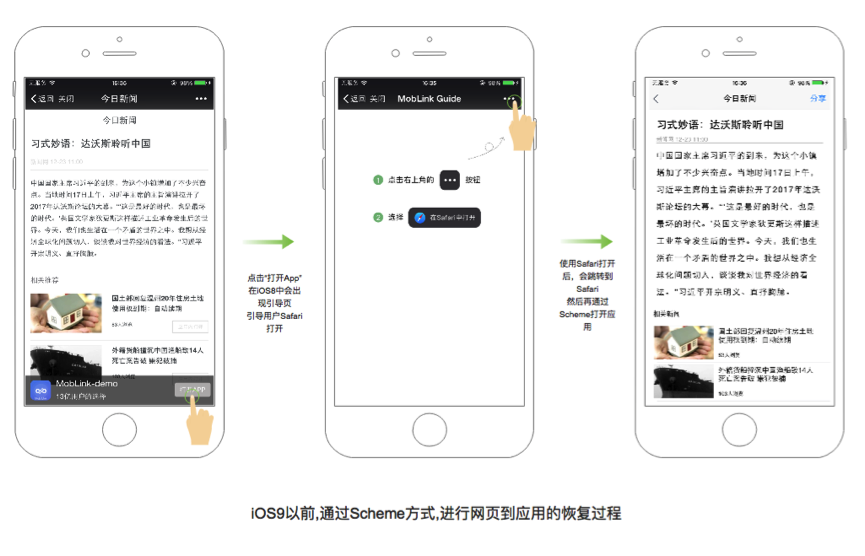
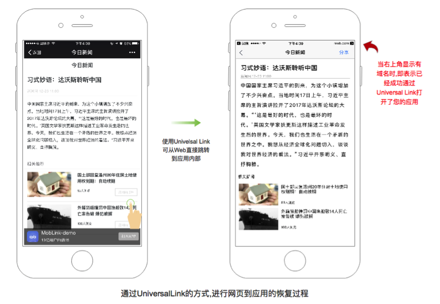

# iOS Universal Links

[Support Universal Links(官网)](https://developer.apple.com/library/archive/documentation/General/Conceptual/AppSearch/UniversalLinks.html#//apple_ref/doc/uid/TP40016308-CH12-SW1)

[iOS 接入微信](https://developers.weixin.qq.com/doc/oplatform/Mobile_App/Access_Guide/iOS.html)

[Apple 检测apple-app-site-association文件是否正确(App Search API验证工具)](https://search.developer.apple.com/appsearch-validation-tool/)

[三方Universal Link集成](http://wiki.mob.com/moblink-universal-link-doc/)

## Universal Link 介绍

Universal Link是苹果在WWDC 2015上提出的iOS 9的新特性之一。此特性类似于深层链接，并能够方便地通过打开一个Https链接来直接启动您的客户端应用(手机有安装App)。对比起以往所使用的URL Sheme, 这种新特性在实现web-app的无缝链接时能够提供极佳的用户体验。

Universal Link 是 Apple 从 iOS 9 引入的一种打通 web 和 app 之间跳转的机制。在 Safari 或者 WebView 中打开与 app 关联的链接时，会自动跳转到 app 并且不丢失参数内容。Universal Link 解决了 URL Scheme 的部分问题：

（1）当跳转失败时，会直接在 Safari/WebView 中打开链接；
（2）可以借助 Universal Link 统一 web 端和 native 的路由；
（3）跳转时不会弹出提示框，体验更好。

这具体是一种怎样的情景呢？举个例子，你的用户在微信里面浏览一个你们公司的网页，而此时用户手机也同时安装有你们公司的App ；而universal link 能够使的用户在打开某个详情页时直接打开你的app 并到达app中相应内容的页面，从而实施用户想要的操作(例如查看某条新闻,例如查看某个商品的明细)

以下分别为URL Scheme方式及Universal Link的方式呈现场景恢复的过程

以下为URL Scheme方式: (第一张图是在微信中浏览web,下同)



以下为Universal Link方式:



通过上述对比得知,Universal Link能够直接从微信中打开App,比起以往的URL Scheme的方式能够大大改善用户体验。

更了了微信`SDK`后发现注册时需要添加`universalLink`(微信SDK1.8.6后的版本需要)。
```
/*! @brief WXApi的成员函数，向微信终端程序注册第三方应用。
 *
 * 需要在每次启动第三方应用程序时调用。
 * @attention 请保证在主线程中调用此函数
 * @param appid 微信开发者ID
 * @param universalLink 微信开发者Universal Link
 * @return 成功返回YES，失败返回NO。
 */
+ (BOOL)registerApp:(NSString *)appid universalLink:(NSString *)universalLink;
```

## 制作 Universal Links

1. 创建一个名为`apple-app-site-association`的文件，如下：
```
{
    "applinks": {
        "apps": [],
        "details": [
            {
                "appID": "Team ID.cn.yunxitech.XXX",
                "paths": ["/yunxi/*"]
            },
            {
                "appID": "Team ID.cn.yunxitech.XXX",
                "paths": ["/yunxitest/*"]
            }
        ]
    }
}
```
`Team ID`为苹果开发者账号中的ID，如`34E443NFE9`十位码。后面跟应用包名。

2. 上传该文件到你的域名所对应的根目录或xxx目录下，`apple-app-site-association`文件不需要扩展名。

**注意**：这个url地址必须支持https访问

苹果提供了一个[网页来验证](https://search.developer.apple.com/appsearch-validation-tool/)我们编写的这个`apple-app-site-association`是否合法有效。

```
根目录
https://yunxitech.cn/apple-app-site-association

xxx目录
https://yunxitech.cn/xxx/apple-app-site-association
```

## 使用 Universal Links

1. 在微信开放平台填写universalLink

2. 在应用的`Signing&Capabilities`->`Capability`点击`+`->添加`Associated Domains`
添加`Domains`格式`applinks:域名`如：`applinks:yunxitech.cn`

3. 将`weixinULAPI`添加到白名单中。
`info.plist`->`LSApplicationQueriesSchemes`->添加`weixinULAPI`
```
-canOpenURL: failed for URL: "weixinULAPI://" - error: "This app is not allowed to query for scheme weixinulapi"
```
测试：Safari输入`Universal Links`如：`https://yunxitech.cn/yunxi/`或`https://yunxitech.cn/yunxi/tdy`
下拉页面检查是否有打开app的入口提示，则成功了

### 微信中使用

1. 要使你的程序启动后微信终端能响应你的程序，必须在代码中向微信终端注册你的 id。（如下图所示，在 AppDelegate 的 didFinishLaunchingWithOptions 函数中向微信注册 id）。
```
- (BOOL)application:(UIApplication *)application didFinishLaunchingWithOptions:(NSDictionary *)launchOptions {
    //向微信注册
    [WXApi registerApp:APP_ID
universalLink:UNIVERSAL_LINK];
    return YES;
}
```
```swift
WXApi.registerApp(YXKEY.WEIXI_APP_ID, universalLink: "https://yunxitech.cn/yunxi/")
```
2. 重写 AppDelegate 的 handleOpenURL 和 openURL 方法：
```
- (BOOL)application:(UIApplication *)application handleOpenURL:(NSURL *)url {
    return  [WXApi handleOpenURL:url delegate:self];
}

- (BOOL)application:(UIApplication *)application openURL:(NSURL *)url sourceApplication:(NSString *)sourceApplication annotation:(id)annotation {
    return [WXApi handleOpenURL:url delegate:self];
}
```
```swift
func application(_ application: UIApplication, handleOpen url: URL) -> Bool {
    return WXApi.handleOpen(url, delegate: self)
}

func application(_ application: UIApplication, open url: URL, sourceApplication: String?, annotation: Any) -> Bool {
    return WXApi.handleOpen(url, delegate: self)
}

func application(_ app: UIApplication, open url: URL, options: [UIApplicationOpenURLOptionsKey : Any] = [:]) -> Bool {
    return WXApi.handleOpen(url, delegate: self)
}
```
3. 重写`AppDelegate`或`SceneDelegate`的`continueUserActivity`方法： 注意：适配了`SceneDelegate`的App，系统将会回调`SceneDelegate`的`continueUserActivity`方法，所以需要重写`SceneDelegate`的该方法。
AppDelegate:
```
- (BOOL)application:(UIApplication *)application continueUserActivity:(NSUserActivity *)userActivity restorationHandler:(void(^)(NSArray<id<UIUserActivityRest
oring>> * __nullable restorableObjects))restorationHandler {
    return [WXApi handleOpenUniversalLink:userActivity delegate:self];
}
```
```swift
func application(_ application: UIApplication, continue userActivity: NSUserActivity, restorationHandler: @escaping ([Any]?) -> Void) -> Bool {
    YXPrint("app被唤醒")
    return WXApi.handleOpenUniversalLink(userActivity, delegate: self)
}
```
SceneDelegate:
```
- (void)scene:(UIScene *)scene continueUserActivity:(NSUserActivity *)userActivity {
    [WXApi handleOpenUniversalLink:userActivity delegate:self];
}
```
