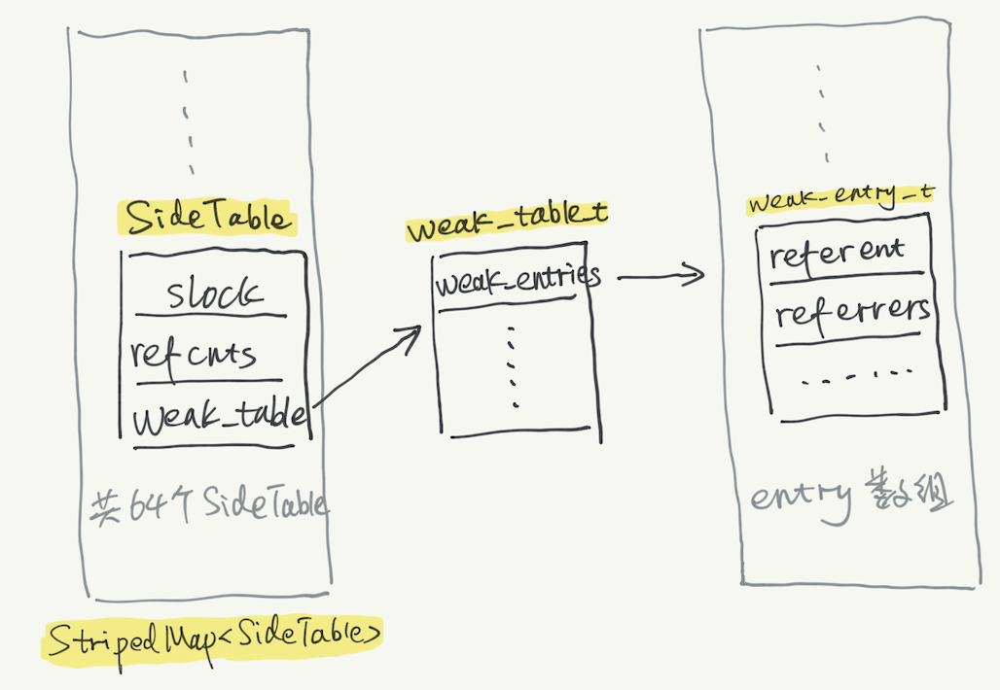

# iOS_weak

[iOS weak 的底层实现原理](http://jefferyfan.com/2019/11/15/programing/iOS/weak/)

先解释两个单词，referent 是指 weak 变量指向的对象，referrer 是指 weak 变量。

最外层是一个 StripedMap，以 referent 实例地址作为 key，通过哈希，平均映射到 64 个 SideTable 中。
SideTable 中最关键的一个成员是 weak_table，weak_table 的成员 weak_entries 是一个 weak_entry_t 结构体数组，每一个 weak_entry_t 结构体都保存着 referent 地址和指向这个 referent 的所有 weak 变量地址，也就是 referrers 数组。

runtime 源码解释
了解了结构，再来单独聊聊刚刚在汇编中看到的几个函数。

objc_initWeak
通过 referent 去找 SideTable，再遍历 weak_entries 找到对应的 weak entry（ weak_entry_t 结构体），将 weak 变量地址添加到对应的 referrers 数组中。当然，如果没有找到 weak entry，会创建一个。

objc_loadWeak
本身 weak 变量已经指向了 referent。objc_loadWeak 内部检查是否是 tag pointer、是否允许 weak reference 等等条件。并查找是否有对应的 weak entry，如果能找到且各种条件满足，则返回 referent 地址，否则返回 nil。

这里返回的 referent 地址，在 runtime 层已经 retain & autorelease。

objc_destroyWeak
这个函数就是 objc_initWeak 的反向操作，把 weak 变量指针从 referrers 数组中移出。如果 referrers 数组为空，那么也顺带会移除 weak entry。
讲了这么多，那这些 weak 指针置为 nil 的逻辑在哪里呢？
从 NSObject 的 dealloc 源码入手，可以看到最后调用到了 weak_clear_no_lock 方法。

weak_clear_no_lock
这个函数主要逻辑是找到对应的 weak entry，遍历 referrers 数组，将所有的 weak 变量都置为 nil，再将 weak entry 移除掉。

Runtime会维护一个weak表，用于维护指向对象的所有weak指针。weak表是一个哈希表，其key为所指对象的指针，value为weak指针的地址数组。
具体过程如下：
1、初始化时：runtime会调用objc_initWeak函数，初始化一个新的weak指针指向对象的地址。
2、添加引用时：objc_initWeak函数会调用 objc_storeWeak() 函数，更新指针指向，创建对应的弱引用表。
3、释放时，调用clearDeallocating函数。clearDeallocating函数首先根据对象地址获取所有weak指针地址的数组，然后遍历这个数组把其中的数据设为nil，最后把这个entry从weak表中删除，最后清理对象的记录。

weak表其实是一个哈希表，key是所指对象的指针，value是weak指针的地址数组。 (value是数组的原因是：因为一个对象可能被多个弱引用指针指向）
Runtime维护了一张weak表，用来存储某个对象的所有的weak指针。
weak原理实现过程三步骤
1. 初始化开始时，会调用objc_initWeak函数，初始化新的weak指针指向对象的地址
2. 紧接着，objc_initWeak函数里面会调用objc_storeWeak () 函数，objc_storeWeak () 函数的作用是用来更新指针的指向，创建弱引用表。
3. 在最后会调用clearDeallocating函数。而clearDeallocating函数首先根据对象的地址获取weak指针地址的数组，然后紧接着遍历这个数组，将其中的数组开始置为nil, 把这个entry 从weak表中删除，最后一步清理对象的记录。

1、runtime 维护了一个存储所有 weak 的散列表 weak_table_t，它存储在 SideTable 结构体里，同时 SideTable 结构体还存储着引用计数表 RefcountMap 和自旋锁 spinlock_t。
2、weak_table_t 是一个哈希表，其中 key 为所指向对象的指针，value 为 weak 指针的地址数组。
3、当一个对象被销毁时，会自动调用 dealloc，此时会查看 weak_table_t 散列表，根据对象的地址取出 weak 清空，并将指向当前对象的弱指针置为 nil（zeroing weak pointer），防止野指针产生。